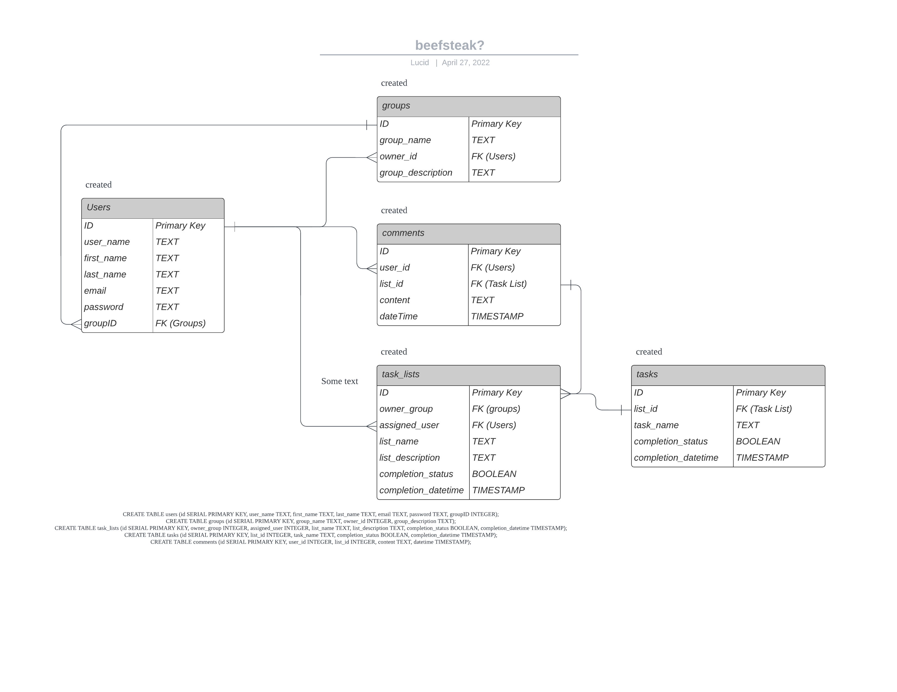
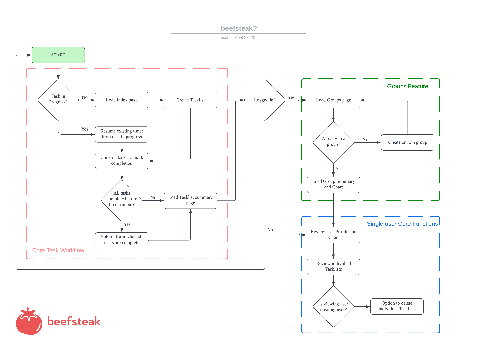

# beefsteak

[beefsteak logo](./public/beefsteak_logo.svg)

A task-oriented time management app that's a bit juicer than your average pomodoro.

> wait, what? why is this productivity app called beefsteak?

The core functionality of this app revolves around breaking tasks down into bite-size chunks that are manageable within the 25-minute focus interval of the [Pomodoro Technique](https://en.wikipedia.org/wiki/Pomodoro_Technique), which was named after the tomato-shaped kitchen timer that its creator used.  
Since this app introduces additional features to aid in keeping longer-term productivity, such as personal tracking to view your own time in focus, and user groups to connect with other individuals who might be working on similar tasks, i.e. a tomato (pomodoro) with additional features (juicier). I picked the variety of tomato that is best known for its juiciness, and named by app after it.

TLDR: i created an entire app to make a tomato pun

#### Features

- Quick-start Pomodoro timer that lets you schedule and complete tasks on the fly
- No user login for basic timer functionality!
- Hiccup-resistant
  - Accidentally closed the tab? The timer resumes automatically!
- Persistent Data
  - Even guests users can acess previously-completed tasklists
- Timestamped task and tasklist completion
- Live Activity charting
  - See how much time you've spent in focus in the past week, or your task completion rate!
- User-created groups for collaboration or progress-sharing between members

#### Future Enhancements

- Group Tasklist creation
  - Create a tasklist in a group for users to assign to themselves
- Group Charting
  - Include focus charting for all members
- Commenting
  - Allow users to comment on any single tasklist page

#### Libraries Used

- [express](https://www.npmjs.com/package/express)
- [pg](https://www.npmjs.com/package/pg)
- [method-override](https://www.npmjs.com/package/method-override)
- [jssha](https://www.npmjs.com/package/jssha)
- [cookier-parser](https://www.npmjs.com/package/cookie-parser)
- [EJS](https://ejs.co/)
- [chart.js](https://www.chartjs.org/)

#### Other Resources Used

- [Bootstrap 5.1](https://getbootstrap.com/) for UI
- [PostgreSQL](https://www.postgresql.org/) for database
- [Looka](https://looka.com/s/87793895) for logo generation
- [LucidChart](https://www.lucidchart.com/pages/) for ERD and UFD creation

#### Entity Relationship Diagram (ERD)

#### User Flow Diagram (UFD)

